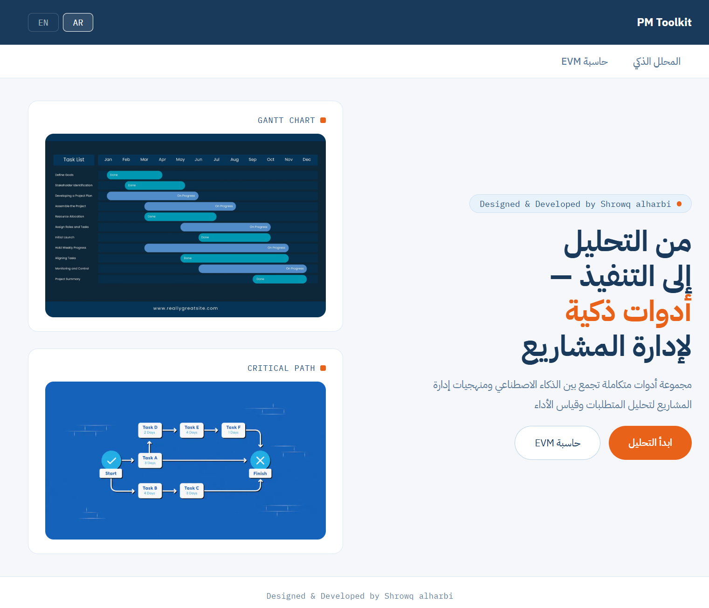
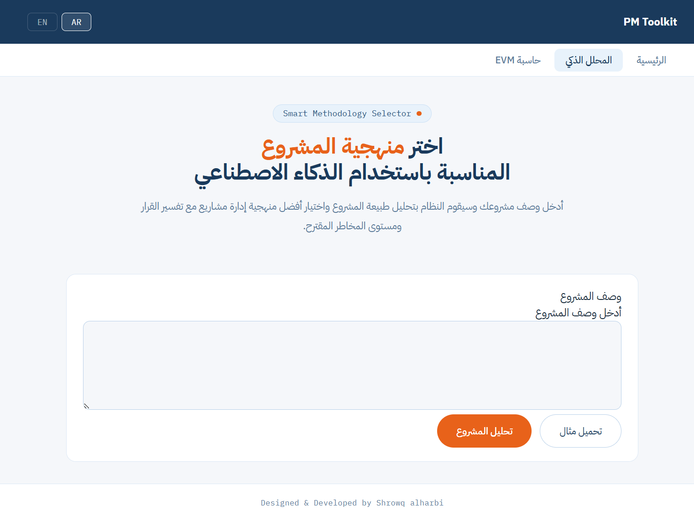
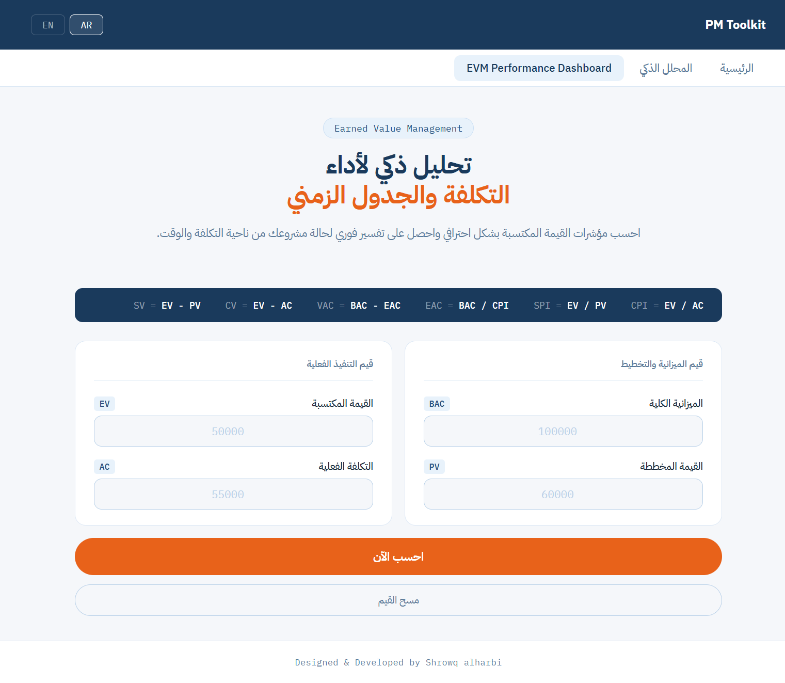
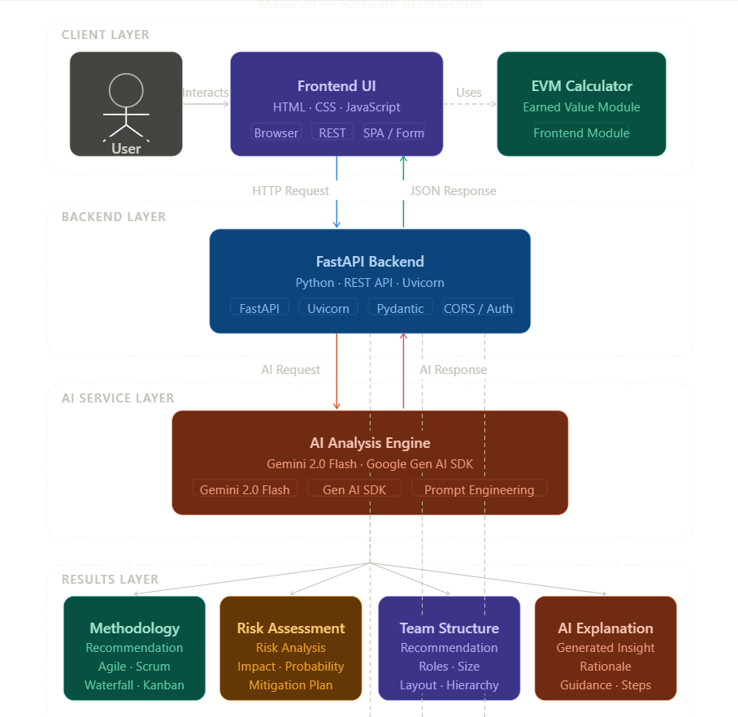
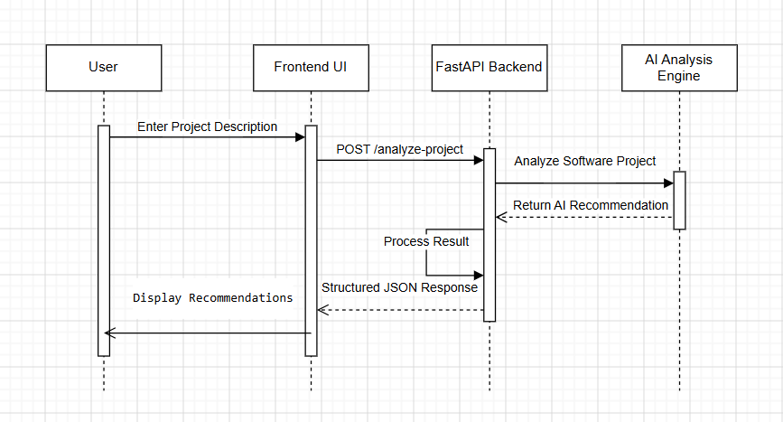
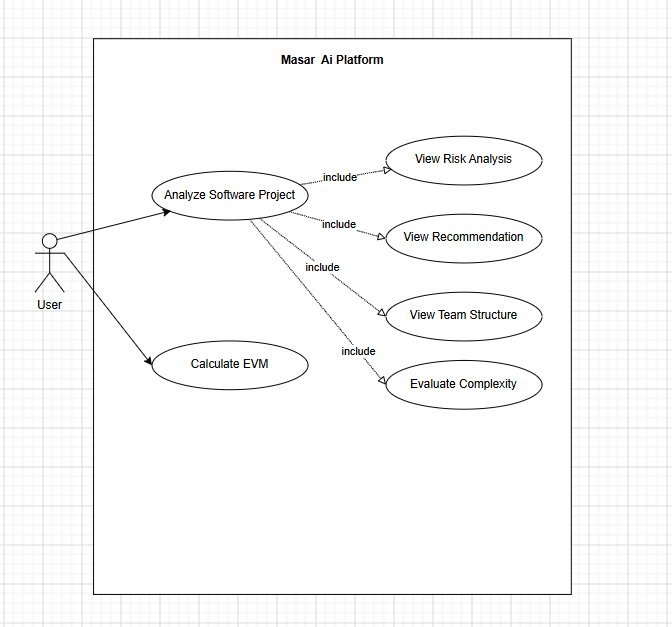
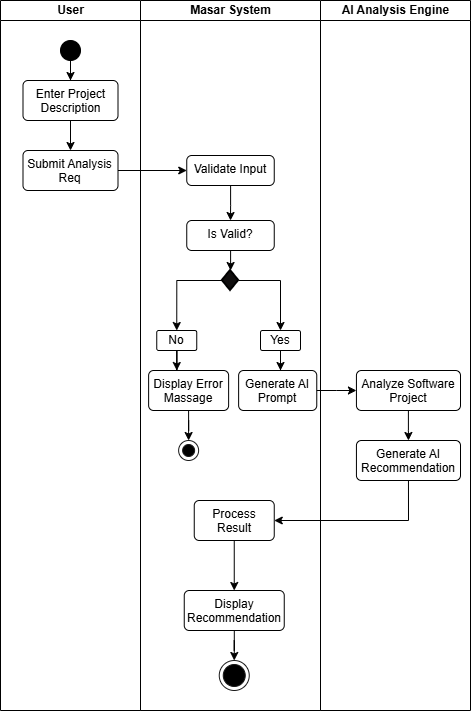

# Masar AI — Smart Project Management Assistant

Masar AI is a modern AI-powered project management toolkit designed to help users analyze software projects, evaluate requirements, and apply project management methodologies using intelligent recommendations and EVM calculations.

The project was designed and developed as an academic project focusing on:

* Software Analysis & Design
* Frontend Development
* AI Integration
* Project Management Concepts

---

## ✨ Features

### 🔍 AI Project Analyzer

Analyzes software project descriptions and provides:

* Functional requirements
* Non-functional requirements
* Suggested development methodology
* Risk analysis
* Project phase recommendations

### 📊 EVM Calculator

Calculates important project management metrics including:

* Planned Value (PV)
* Earned Value (EV)
* Actual Cost (AC)
* Cost Performance Index (CPI)
* Schedule Performance Index (SPI)
* Cost Variance (CV)
* Schedule Variance (SV)

### 🌐 Bilingual Interface

* Arabic 🇸🇦
* English 🇺🇸

### 🎨 Modern UI Design

* Responsive layout
* RTL/LTR support
* Clean project-management inspired design

---

# 🛠️ Technologies Used

## Frontend

* HTML5
* CSS3
* JavaScript

## Backend

* Python
* FastAPI

## AI Integration

* Gemini API

---

# 📁 Project Structure

```bash
PM-Toolkit/
│
├── front-end/
│   ├── index.html
│   ├── style.css
│   ├── project-analyzer.html
│   ├── evm-calculator.html
│   └── IMG/
│
├── back-end/
│   ├── main.py
│   ├── analyzer.py
│   └── requirements.txt
│
└── README.md
```

---

# 📸 Screenshots

## 🏠 Home Page

ضع صورة الهوم هنا:




---

## 🤖 AI Project Analyzer

ضع صورة صفحة المحلل هنا:




---

## 📈 EVM Calculator





---

# 🧠 System Workflow

1. User enters software project description
2. Frontend sends request to FastAPI backend
3. Backend processes the request
4. Gemini API analyzes the project
5. Structured analysis results are returned
6. Frontend displays recommendations and project insights

---

# 📐 UML & Design Diagrams

The project includes several analysis and design diagrams:

* Use Case Diagram
* Activity Diagram
* Sequence Diagram
* Architecture Diagram

You can place all diagrams inside:

Example:

## 📌 Architecture Diagram



## 📌 Sequence Diagram



## 📌 Use Case Diagram



## 📌 Activity Diagram




---

# 🚀 How to Run

## Frontend

Simply open:

```bash
index.html
```

Or use VS Code Live Server.

---

## Backend

Install dependencies:

```bash
pip install -r requirements.txt
```

Run FastAPI server:

```bash
uvicorn main:app --reload
```

---

# 🎯 Project Goals

* Simplify project requirement analysis
* Integrate AI into software project planning
* Apply project management methodologies practically
* Build a modern bilingual web interface

---

# 👩‍💻 Developer

**Designed & Developed by Shrowq Alharbi**

---

# 📄 License

This project was developed for educational and academic purposes.
